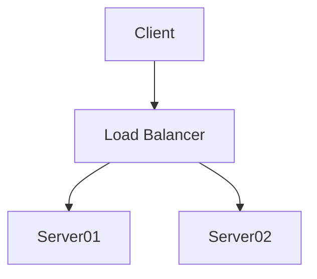
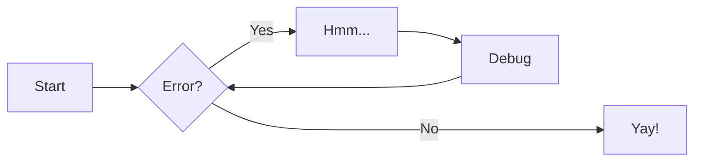
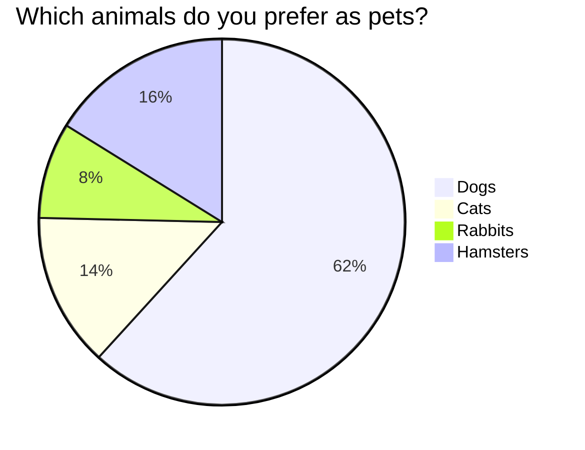
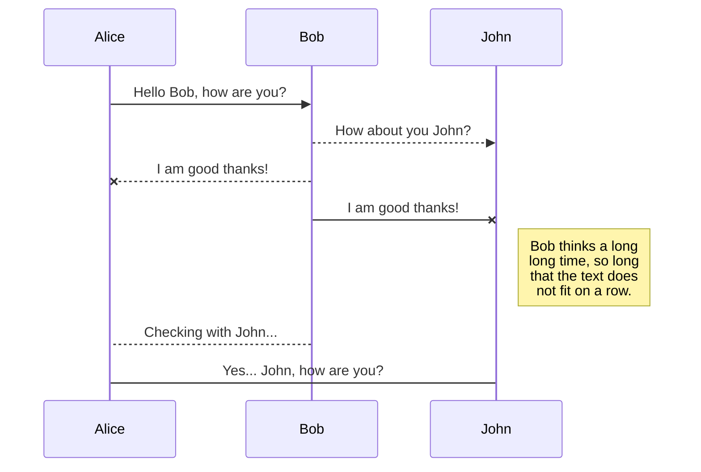

Esta pagina muestra ejemplos de utilidades que se pueden utilizar:

**Importante: La compatibilidad total es con el theme material**

# Incluyendo codigo javascript
Siempre puedes incluir tu codigo en el propio md y sera interpretado


```html
<script>
  window.addEventListener('load', function () {
    alert("Estoy incluyendo codigo javascript")
  });
</script>
```
# Editando tu codigo Mkdocs
Podemos hacer que puedas editar la pagina que estas viendo directamente.

Para esto es tan sencillo como asegurarte de :

  - Tener la propiedad repo_url en tu mkdocs.yaml : 
      Por ejemplo: repo_url: https://github.com/example/repository/
  - Habilitar la theme.feature ( content.action.edit) 
      theme:
        features:
         - content.action.edit  

Esto no solo añadira el boton de edit si no que tambien mostrara el icono de github
(o el SCM que se este usando)

La documentacion oficial esta aqui [https://www.mkdocs.org/user-guide/configuration/#edit_uri](https://www.mkdocs.org/user-guide/configuration/#edit_uri)
# Creando enlaces

<https://editormarkdown.com>

O si son enlaces a esta misma pagina 

[Llevame a Dibujando flujos](#Dibujando Flujos)  (Para esta opcion tiene que estar dado de alta la seccion nav en mkdocs.yaml)

Enviame un email <me@email.com>

# Bloques de informacion

!!! note "Las tablas son elementos muy utiles para mostrar informacion"

    Lorem ipsum dolor sit amet, consectetur adipiscing elit. Nulla et euismod
    nulla. Curabitur feugiat, tortor non consequat finibus, justo purus auctor
    massa, nec semper lorem quam in massa.

!!! warning "Pero ten cuidado con el azucar"

    por lo visto y te puede
    dar un infarto

> Siento dejar este mundo sin probar pipas Facundo


> ## Blockquoted header
>
> This is blockquoted text.
>
> This is a second paragraph within the blockquoted text.
>> Y este es un subparrafo

# Separadores horizontales (lineas)

<hr style="border:1px solid gray">

# :octicons-shield-check-16: **Iconos**

Hay varios iconos que vienen de serie y que estan en la carpeta .icons y sus subdirectorios.

Para usarlos basta con indicar la ruta de subdirectorios en vez de con slash usando hypens (guiones)

:fontawesome-solid-angry:  estamos usando el icono en la ruta .icons/fontawesome/solid/angry.svg (como estamos usando la imagen docker no podemos explorar el directorio de iconos, pero se puede consultar descargando el codigo de mkdocs material)

:material-material-design:  (este icono pertenece a .icons/material/material-design.svg)

> :octicons-key-16:  Este icono esta en .icons/octicons/key-16.svg

Incluye estilos en tu pagina para customizar tus iconos


:material-material-design:{ .medium } – Medium

:fontawesome-brands-twitter:{ .twitter }

# Listas ordenadas

1. Primer elemento
2. Segundo elemento
3. Tercer elemento

## Listas desordenadas

* opcion A
* opcion B
* opcion C

# Codigo resaltado
- ==This was marked==
- ^^This was inserted^^
- ~~This was deleted~~

# Bloques colapsados
??? code "docker-compose.yaml"

    ```yaml linenums="1"
    version: '3.7'
    networks:
      local:
        external: true
    services:
      postgres11:
      
    volumes:
      postgresql:
      postgres11-data:
        driver: local
    ```

# Dibujando Flujos

Usando mermaid [https://mermaid.js.org/config/theming.html](https://mermaid.js.org/config/theming.html)


Secuence diagram example



Secuence diagram


# Dibujando graficas

Usando Vegalite plugin 
(documentacion aqui https://vega.github.io/vega-lite/examples/)
**Para que esto funcione es necesario tener una pagina index.md en la raiz** no se porque , pero es asi

```vegalite 
{
  "description": "A simple bar chart with embedded data.",

  "data": {"url" : "https://raw.githubusercontent.com/timvink/mkdocs-charts-plugin/main/docs/assets/charts/data/basic_bar_chart.json"},

  "mark": {"type": "bar", "tooltip": true},
  "encoding": {
    "x": {"field": "a", "type": "nominal", "axis": {"labelAngle": 0}},
    "y": {"field": "b", "type": "quantitative"}
  }
}
```

```vegalite 
{
  "$schema": "https://vega.github.io/schema/vega-lite/v5.json",
  "description": "Google's stock price over time.",
  "data": {"url": "https://vega.github.io/vega-lite/data/stocks.csv"},
  "transform": [{"filter": "datum.symbol==='GOOG'"}],
  "mark": "line",
  "encoding": {
    "x": {"field": "date", "type": "temporal"},
    "y": {"field": "price", "type": "quantitative"}
  }
}
```

# Usando Tablas


| Method      | Description                          |
| :---------: | :----------------------------------: |
| `GET`       | :material-check:     Fetch resource  |
| `PUT`       | :material-check-all: Update resource |
| `DELETE`    | :material-close:     Delete resource |

# Usando Tabs

=== "Tab 1"

    Lorem ipsum dolor sit amet, (1) consectetur adipiscing elit.
    { .annotate }

    1.  :man_raising_hand: I'm an annotation!

=== "Tab 2"

    Phasellus posuere in sem ut cursus (1)
    { .annotate }

    1.  :woman_raising_hand: I'm an annotation as well!

=== "Tab 3"

    | Method      | Description                          |
    | :---------: | :----------------------------------: |
    | `GET`       | :material-check:     Fetch resource  |
    | `PUT`       | :material-check-all: Update resource |
    | `DELETE`    | :material-close:     Delete resource |

# Creando listas de checks

- [x] Lorem ipsum dolor sit amet, consectetur adipiscing elit
- [ ] Vestibulum convallis sit amet nisi a tincidunt
    * [x] In hac habitasse platea dictumst
    * [x] In scelerisque nibh non dolor mollis congue sed et metus
    * [ ] Praesent sed risus massa
- [ ] Aenean pretium efficitur erat, donec pharetra, ligula non scelerisque


# Imagenes con texto al lado


{ align=left loading=lazy }Como podemos apreciar en la foto de al lado nuestro
se muestra una imagen vacia del site http://dummyimage.com .

Otro parrafo tambien al lado de la foto.

Si queremos empezar a escribir ya debajo de la foto, debemos meter tantos '< br />' como necesitemos hasta salirnos.
<br />
<br />
<br />
<br />

Ya estoy fuera en el siguiente parrafo, ves?.

## Imagenes con titulo

<figure markdown>
  { width="300" }
  <figcaption>Esta imagen es impresionante</figcaption>
</figure>

# Generando el site estatico   
Si queremos generar el site estatico 
```
docker run --rm -it -p 9999:8000 -v /home/dpena/Documentos/deadveloper/Guias:/docs danipenaperez/mkdocs  build
```    
Este comando  creara un directorio /site donde estaran todos los html

Despues desplegarlos en algun servidor de codigo estatico o en un gh-pages. Por ejemplo aqui usamos un nginx para
probar a desplegar los estaticos generados
```
docker run -it --rm -d -p 8080:80 --name borrame -v /home/dpena/Documentos/deadveloper/Guias/site:/usr/share/nginx/html nginx
sensible-browser http://localhost:8080
```


# Otros themes

Este pinta bien https://github.com/ppoffice/hexo-theme-icarus


# Generando pies de pagina
[^1]: Lorem ipsum dolor sit amet, consectetur adipiscing elit.

[^2]:
    Lorem ipsum dolor sit amet, consectetur adipiscing elit. Nulla et euismod
    nulla. Curabitur feugiat, tortor non consequat finibus, justo purus auctor
    massa, nec semper lorem quam in massa.